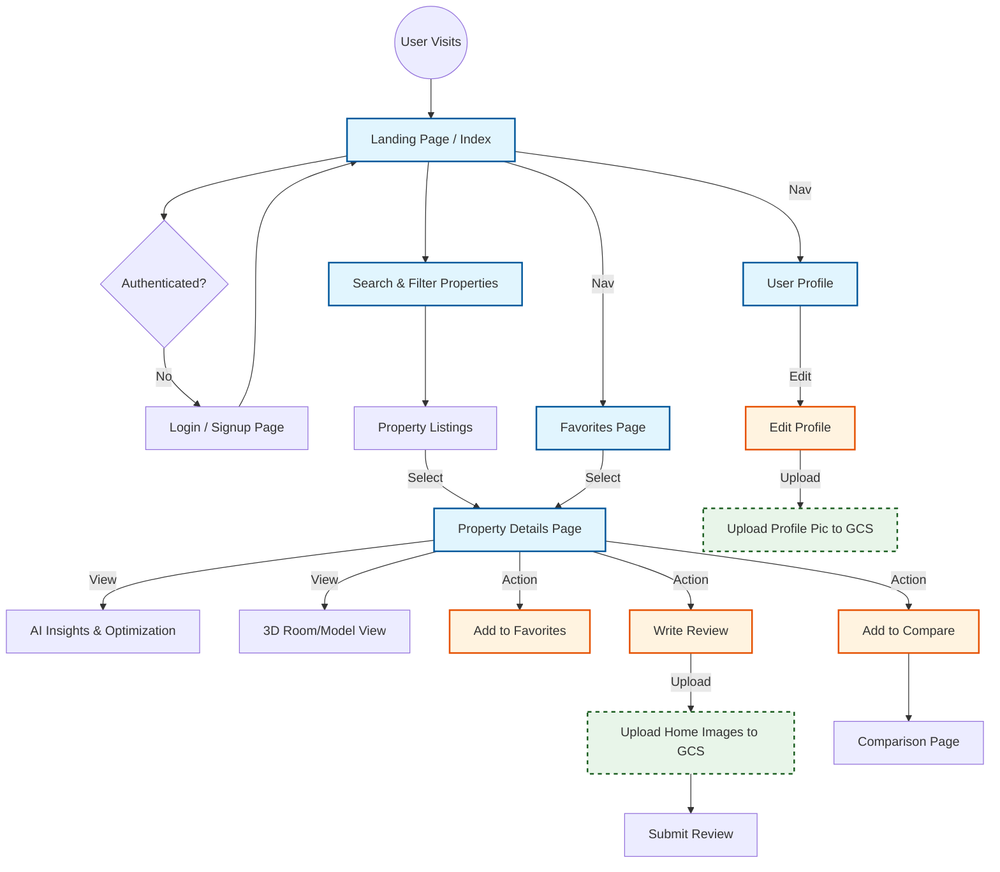

# Student Haven Hub - Process Flow Diagram

This diagram visualizes the user journey throughout the entire application, from landing page to property booking/reviewing.

```mermaid
graph TD
    %% Nodes
    Start((User Visits)) --> Landing[Landing Page / Index]
    Landing --> Search[Search & Filter Properties]
    Landing --> Auth{Authenticated?}
    
    %% Auth Flow
    Auth -- No --> Login[Login / Signup Page]
    Login --> Landing
    
    %% Main Flows
    Search --> PropertyList[Property Listings]
    PropertyList -->|Select| Details[Property Details Page]
    
    %% Property Details Actions
    Details -->|View| AI[AI Insights & Optimization]
    Details -->|View| 3D[3D Room/Model View]
    Details -->|Action| Fav[Add to Favorites]
    Details -->|Action| Compare[Add to Compare]
    
    %% Review Flow (Including Image Upload)
    Details -->|Action| Review[Write Review]
    Review -->|Upload| UploadGCS[Upload Home Images to GCS]
    UploadGCS --> SubmitReview[Submit Review]
    
    %% Comparison Flow
    Compare --> ComparePage[Comparison Page]
    
    %% User Profile Flow
    Landing -->|Nav| Profile[User Profile]
    Profile -->|Edit| EditProfile[Edit Profile]
    EditProfile -->|Upload| UploadProfile[Upload Profile Pic to GCS]
    
    %% Favorites
    Landing -->|Nav| Favorites[Favorites Page]
    Favorites -->|Select| Details

    %% Styles
    classDef primary fill:#e1f5fe,stroke:#01579b,stroke-width:2px;
    classDef action fill:#fff3e0,stroke:#e65100,stroke-width:2px;
    classDef storage fill:#e8f5e9,stroke:#1b5e20,stroke-width:2px,stroke-dasharray: 5 5;
    
    class Landing,Search,Details,Profile,Favorites primary;
    class Fav,Compare,Review,EditProfile action;
    class UploadGCS,UploadProfile storage;
```
